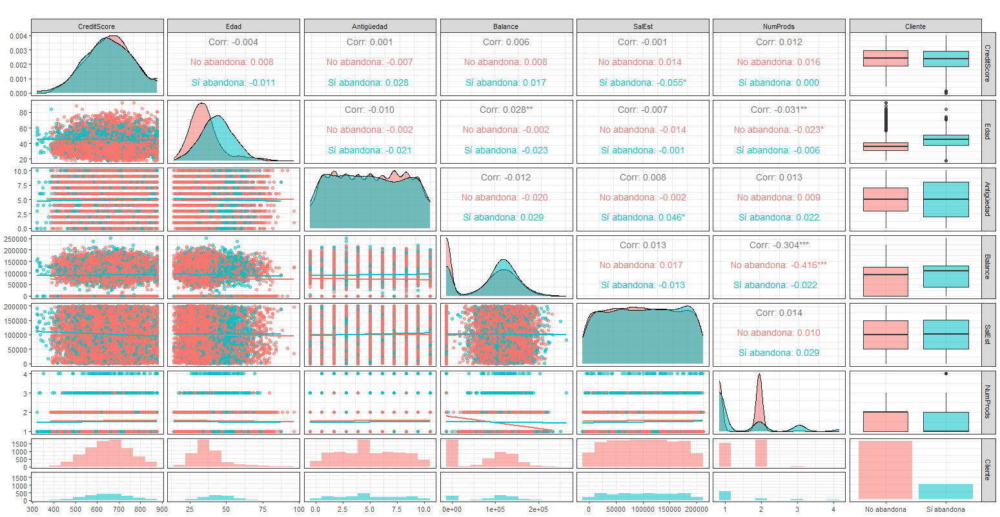
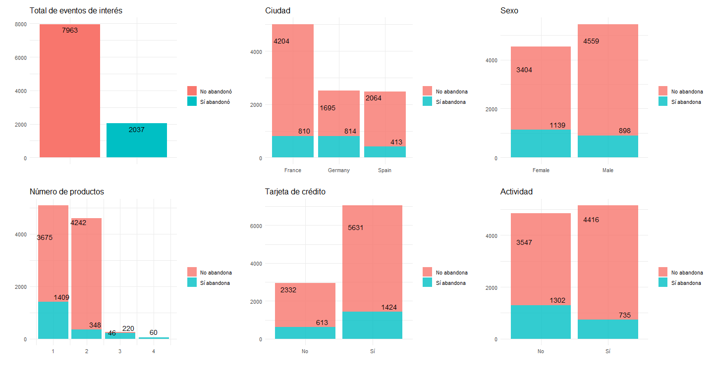

# Análisis Predictivo de Abandono de Clientes (Bank Churn)
Este proyecto desarrolla un sistema de clasificación para predecir la probabilidad de que un cliente cancele su cuenta bancaria. 
Utilizando técnicas de Machine Learning se busca identificar a los clientes en riesgo de abandono, lo cual permitiría a las instituciones financieras tomar medidas preventivas de retención.

## Desafíos Técnicos
Desbalance de Clientes: La base original presentaba un 80% de permanencia vs. un 20% de abandono. Se solucionó utilizando SMOTE-NC para equilibrar las clases y evitar sesgos en el entrenamiento.

## Herramientas Utilizadas
* **Lenguaje:** R
* **Librerías principales:** `tidymodels`, `themis` (para SMOTENC), `psych`, `ggplot2` (visualización).

## Variables predictoras 
Score Crediticio, Ciudad, Sexo, Edad, Antigüedad, Balance, Número de Productos, Tarjeta de Crédito, Actividad y Salario Estimado

## Hallazgos del Análisis Exploratorio (EDA)
Edad: Factor determinante; se observa una distribución distinta entre quienes se van y quienes se quedan.
No existen correlación lienal evidente entre las variables predictoras.
Las variables predictoras manifiestan una distrubución normal o uniforme(Antigüedad y Salario Estimado). 

## Entrenamiento y optimización de hiperparámetros mediante validación cruzada para los siguientes algoritmos:
Se empleó el algoritmo K-Nearest Neighbors (KNN) optimizando los hiperparámetros correspondientes al número de vecinos y funciones de peso. 
- En entrenamiento, el modelo reportó un ROC AUC  de **0.803** lo cual indica una capacidad sólida para distinguir entre los dos eventos de interés (el cliente abandona o no).
- En fase de prueba el modelo logra un ROC AUC de **0.79**, que demuestra una capacidad predictiva consistente:

| Métrica       | Valor |
| ------------- | ------ |
| Precisión     | 0.74 |
| Sensibilidad  | 0.69 |
| Especificidad | 0.75 |
| ROC AUC       | 0.79 |

  
##  Resultados Destacados
Una presición de 0.74 no indica que el modelo clasifica correctamente el 74% de los clientes.
De los clientes que sí abandonaron, el modelo detecta correctamente 69%.
De los cleintes que no abandonaron, el modelo detecta correctamente 75%.

De acuerdo con la matriz de confunsión:

| Predicció\Realidad  | Sí abandonó | No abandonó |
| Sí abandonó         |     426     |   593       |
| No abandonó         |     186     |  1796       | 

El ROC AUC = 0.804, indica una buena capacidad de discriminación.
En el 80.4% de los casos, el modelo asigna mayor probabilidad de abandono a un cliente que sí abandona a uno que no.
- 4 de cada 10 clientes marcados como "Sí abandonó" realmente abandonan el banco.
- 9 de cada 10 cleintes marcados como "No abandonó" realemnte no abandonan el banco
El modelo resulta conveniente para filtrar clientes de bajo riesgo con alta convianza (90 %)

*(Agrega aquí imágenes de `img/curva_roc_random_forest.png` y `img/importancia_variables.png` usando sintaxis Markdown: ``)*

## Experimentos Adicionales
Para evaluar la robustez de los modelos, se replicó el análisis bajo dos escenarios:
1.  [cite_start]**Transformación PCA:** Modelado sobre el subespacio de dimensión reducida (7 componentes)[cite: 2068, 2069].

