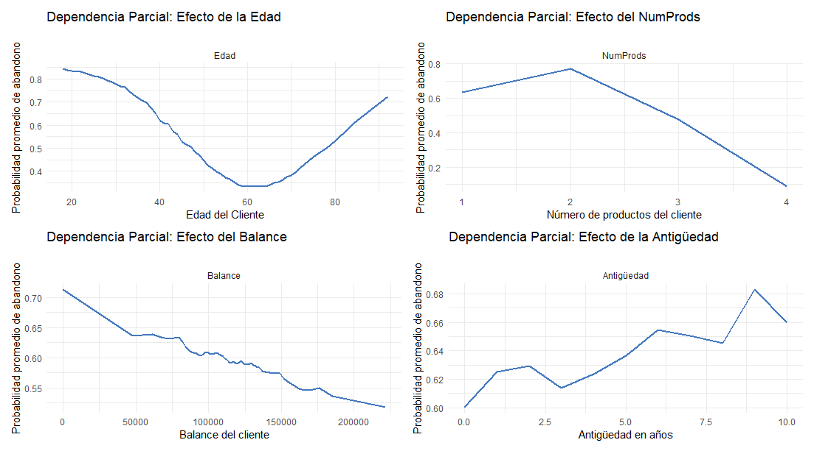

# Análisis Predictivo de Abandono de Clientes (Bank Churn)
Este proyecto desarrolla un sistema de clasificación para predecir la probabilidad de que un cliente cancele su cuenta bancaria. 
Utilizando técnicas de Machine Learning se busca identificar a los clientes en riesgo de abandono, lo cual permitiría a las instituciones financieras tomar medidas preventivas de retención.

## Desafíos Técnicos
Desbalance de Clientes: La base original presentaba un 80% de permanencia vs. un 20% de abandono. Se solucionó utilizando SMOTE-NC para equilibrar las clases y evitar sesgos en el entrenamiento.

## Herramientas Utilizadas
* **Lenguaje:** R
* **Librerías principales:** `tidymodels`, `themis` (para SMOTENC), `psych`, `ggplot2` (visualización).

## Variables predictoras 
Score Crediticio, Ciudad, Sexo, Edad, Antigüedad, Balance, Número de Productos, Tarjeta de Crédito, Actividad y Salario Estimado

## Hallazgos del Análisis Exploratorio (EDA)
Edad: Factor determinante; se observa una distribución distinta entre quienes se van y quienes se quedan.
No existen correlación lienal evidente entre las variables predictoras.
Las variables predictoras manifiestan una distrubución normal o uniforme(Antigüedad y Salario Estimado). 

## Entrenamiento y optimización de hiperparámetros mediante validación cruzada para los siguientes algoritmos:
Se empleó el algoritmo K-Nearest Neighbors (KNN) optimizando los hiperparámetros correspondientes al número de vecinos y funciones de peso. 
- En entrenamiento, el modelo reportó un ROC AUC  de **0.803** lo cual indica una capacidad sólida para distinguir entre los dos eventos de interés (el cliente abandona o no).
- En fase de prueba el modelo logra un ROC AUC de **0.79**, lo que demuestra una capacidad predictiva consistente:

| Métrica       | Valor |
| ------------- | ------|
| Precisión     | 0.74 |
| Sensibilidad  | 0.69 |
| Especificidad | 0.75 |
| ROC AUC       | 0.80 |

  
##  Resultados Destacados
- Una presición de 0.74  indica que el modelo clasifica correctamente el 74% de los clientes.
- De los clientes que sí abandonaron, el modelo detecta correctamente 69%.
- De los cleintes que no abandonaron, el modelo detecta correctamente 75%.

Matriz de confunsión:

| Predicció\Realidad  | Sí abandonó | No abandonó |
| ------------------- |------------ | ----------- |
| Sí abandonó         |     426     |   593       |
| No abandonó         |     186     |  1796       | 

- 4 de cada 10 clientes marcados como "Sí abandonó" realmente abandonan el banco.
- 9 de cada 10 clientes marcados como "No abandonó" realemnte no abandonan el banco.

Por lo tanto el modelo resulta altamente conveniente para filtrar clientes de bajo riesgo con alta confianza (90 %). 

## Análisis de variables de mayor impacto. 
Una de las ventajas de implementar modelos de tipo KNN, es que permite realizar un análsis del impacto de cada variable en la predicción y también permite analizar clientes específicos para comprender a detalle por qué toma la desición de irse o quedarse. 

Gracias a este análisis es posible orientar campañas de retención a segmentos críticos de la población de clientes con características específicas. 

### Importancia de las variables.
- La **Edad** es el factor determinante 
- El **Número de productos**, el **Balance**, la **Antigüedad**, y el **Salario** son factores críticos auqnue con menor peso en la decisión, a continuación se ilustra la **probabilidad promedio** de abandono en función de las variables **Edad**, **NumProds** y **Balance** .

  

  
  
Como se obsrvan en las gráficas anteriores, las relaciones de estas variables con la probabilidad promedio de abandono son complejas. Es aquí donde podemos contrastar estos resultados y las visulaizaciones hechas en la fase exploratoria. 
- Inicialmente, el análisis exploratorio sugería una la relación directamente proporcional entre la edad y el número de clientes que abandonan el banco  (El promedio de clientes que abandonan el banco es mayor que el promedio de clientes que no abandonan el banco ). En la gráfica de Depenndencia parcial de la Edad, se observa un mayor riesgo de abandono en clientes menores cuya edad se encuentra entre 20 y 45 años, así como mayores a 80 años. Pero se observa un bajo reisgo de abandono en clientes con edades mayores a 45 años y menores a 80.  
- Análogamente en cleintes 
