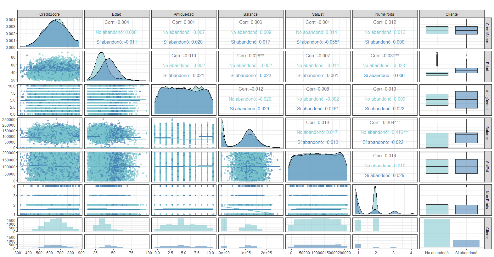
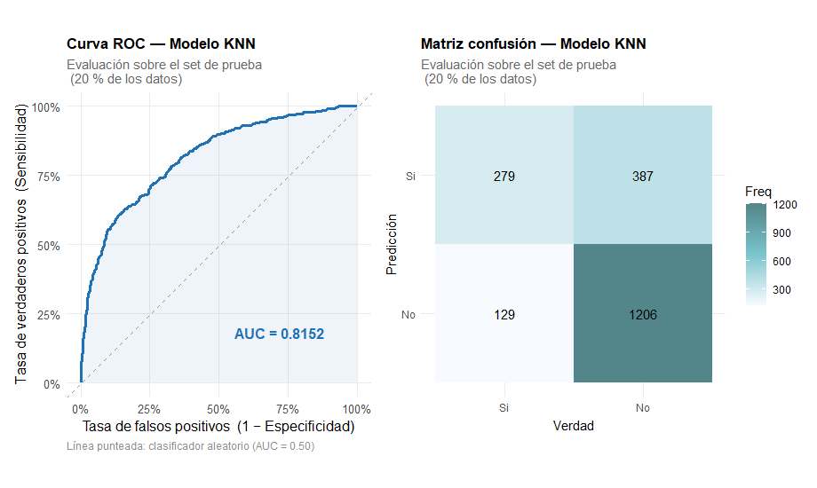
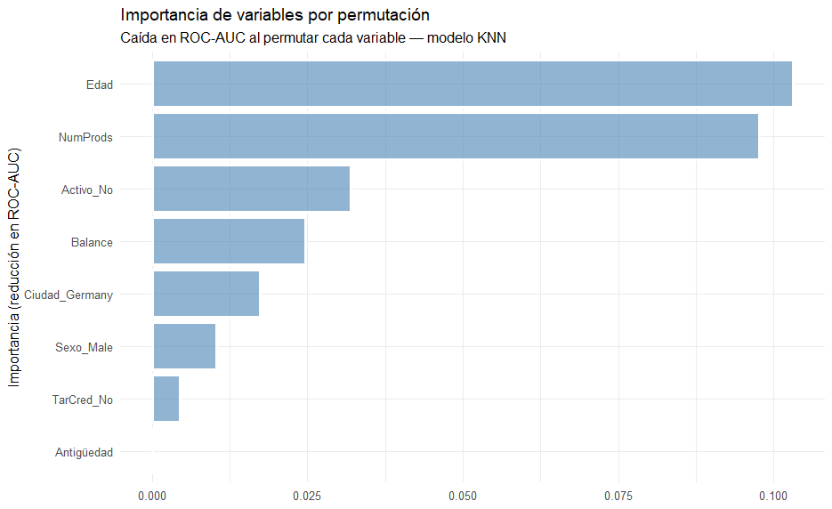
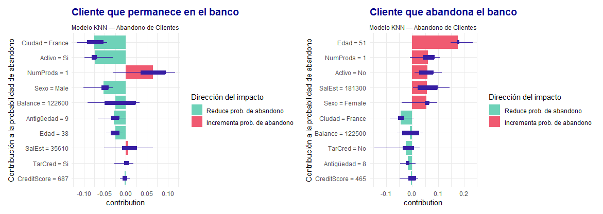

# Análisis Predictivo de Abandono de Clientes (Bank Churn)
Este proyecto desarrolla un sistema de clasificación para predecir la probabilidad de que un cliente cancele su cuenta bancaria. 
Utilizando técnicas de Machine Learning se busca identificar a los clientes en riesgo de abandono, lo cual permitiría a las instituciones financieras tomar medidas preventivas de retención.

## Desafíos Técnicos
Desbalance de Clientes: La base original presentaba un 80% de permanencia vs. un 20% de abandono. Se solucionó utilizando SMOTE-NC para equilibrar las clases y evitar sesgos en el entrenamiento.

## Herramientas Utilizadas
* **Lenguaje:** R
* **Librerías principales:** `tidymodels`, `themis` (para SMOTENC), `psych`, `ggplot2` (visualización).

## Variables predictoras 
Score Crediticio, Ciudad, Sexo, Edad, Antigüedad, Balance, Número de Productos, Tarjeta de Crédito, Actividad y Salario Estimado

## Hallazgos del Análisis Exploratorio (EDA)
Edad: Factor determinante; se observa una distribución distinta entre quienes se van y quienes se quedan.
No existen correlación lienal evidente entre las variables predictoras.
Las variables predictoras manifiestan una distrubución normal o uniforme(Antigüedad y Salario Estimado). 

## Entrenamiento y optimización de hiperparámetros mediante validación cruzada para los siguientes algoritmos:
Se empleó el algoritmo K-Nearest Neighbors (KNN) optimizando los hiperparámetros correspondientes al número de vecinos y funciones de peso. 
- En entrenamiento, el modelo reportó un ROC AUC  de **0.826** lo cual indica una capacidad sólida para distinguir entre los dos eventos de interés (el cliente abandona o no).
- En fase de prueba el modelo logra un ROC AUC de **0.821**, lo que demuestra una capacidad predictiva consistente, a continuación se presentan los resultados que describen el desempeño del modelo, as:

| Métrica       | Valor |
| ------------- | ------|
| Precisión     | 0.74 |
| Sensibilidad  | 0.71 |
| Especificidad | 0.75 |
| ROC AUC       | 0.82 |

  
##  Resultados Destacados
- Una presición de 0.74  indica que el modelo clasifica correctamente el 74% de los clientes.
- De los clientes que sí abandonaron, el modelo detecta correctamente 71%.
- De los cleintes que no abandonaron, el modelo detecta correctamente 75%.

## Análisis de variables de mayor impacto. 
### Importancia de las variables.
Una de las ventajas de implementareste modelo, es que permite realizar un análsis del impacto de cada variable en la predicción y también permite analizar clientes específicos para comprender a detalle por qué toma la desición de irse o quedarse. 
Las variables críticas que más influencían la desición de abandono, son las siguientes :

- La **Edad** es el factor determinante, seguido por el **Número de porductos contratados** 
- La baja **Actividad**, y el **Balance**, también contrubuyen de manera significativa.
- Un hallazgo importante fue la identificación de Alemania como factor de riesgo de abandono.  

A continuación se presenta las gráficas de dependencia parcial, las cuales permiten visualizar el comportamiento de la probabilidad de abandono de las variables críticas identificadas de acueerdo con el modelo.

  
  
Este análisis  permite detallar la relación compleja entre las variables críticas y la probabailidad de abandono de manera global.

## Análisis de casos específicos 
Este procedimiento responde a la pregunta ¿por qué un cliente en especial (caso de interés) decidió abandonar o no abandonar el banco ?
Los resultados se logran mediante el método SHAP (SHapley Additive exPlanations) que permite estimar la contribución de cada característica a una predicción individual de un modelo de machine learning, es decir , permite descomponer una predicción compleja en contribuciones individuales.

  

